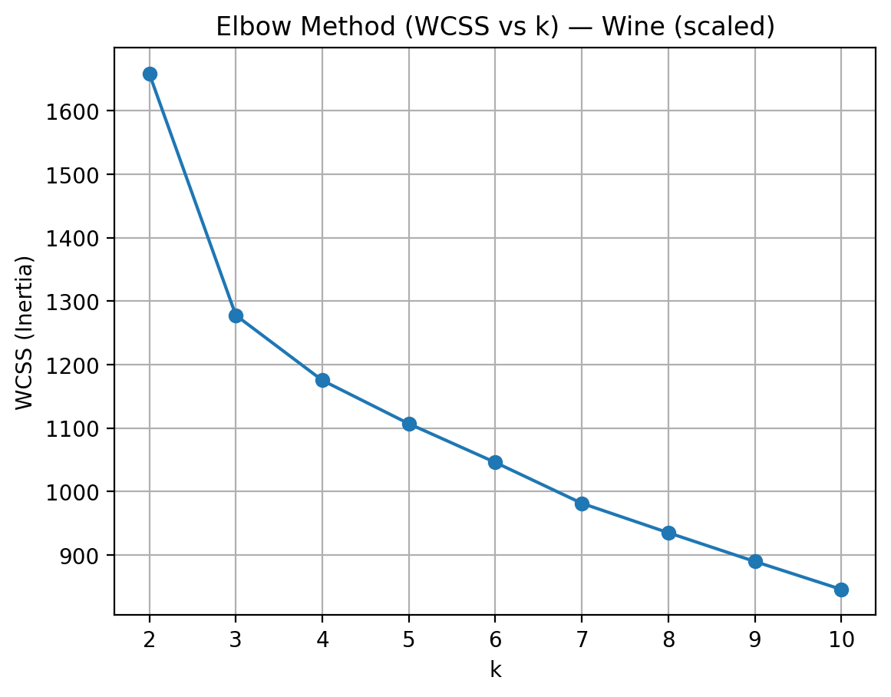
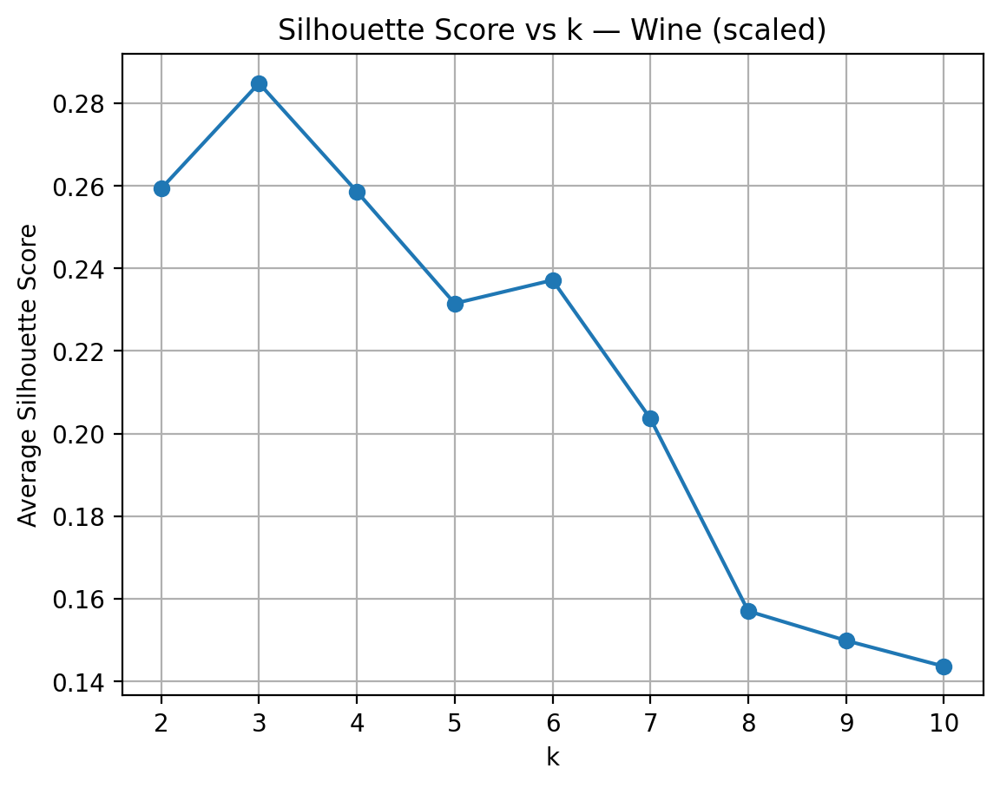
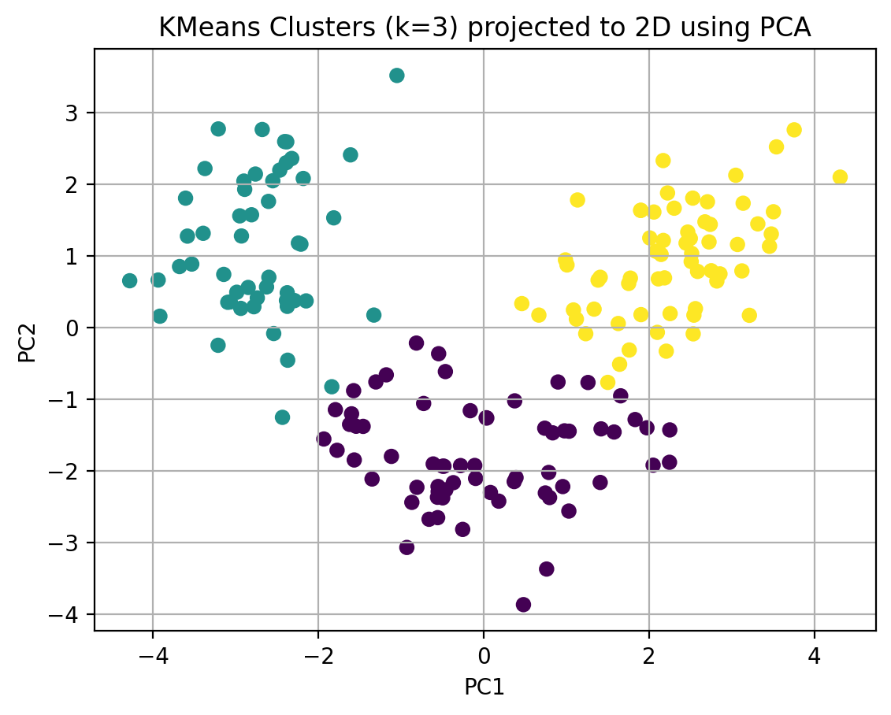

# Week 01 — Clustering (K-means) on Wine Dataset

## Goal
Use k-means clustering to discover natural groupings in the Wine dataset (chemical properties of wines).
Choose an appropriate number of clusters (k) using the Elbow method (WCSS) and Silhouette score, then interpret each cluster using feature summaries.

## Dataset
- Name: Wine dataset (built-in from scikit-learn)
- Size: 178 samples, 13 numeric features
- Description: Each sample represents a wine with measured chemical properties (e.g., alcohol, malic_acid, flavanoids, color_intensity).
- Note: Because k-means is distance-based, feature scaling is required.

## Method (implementation details)
- Scaling: StandardScaler (distance-based clustering is sensitive to feature magnitude)
- Model: KMeans (init="k-means++", n_init=20, random_state=42)
- k search range: k = 2..10 (evaluated with WCSS and Silhouette)

## Choosing k (Elbow + Silhouette)

I evaluated k from 2 to 10 using two metrics: WCSS (Elbow method) and the average Silhouette score.
The Elbow plot shows that WCSS decreases as k increases, but the improvement becomes less significant after a small number of clusters.
The Silhouette curve reached its highest value at **k = 3(≈ 0.285)** (best average separation/compactness), so I selected **k = 3** as the final number of clusters.

This graph shows WCSS decreases rapidly up to around k=3 and then flattens, suggesting diminishing returns beyond this point.

This graph shows the highest average silhouette score occurs at k=3 (≈0.285), indicating the best overall separation/compactness among the tested k values.

## Results (PCA visualisation)

The following plot shows the k-means clustering result (k=3) projected into 2D using PCA.  
The three clusters form clearly separated groups in the PCA space (one cluster on the left, one on the right, and one mainly in the lower region), which suggests the dataset contains strong natural structure that k-means can capture.

This graph shows the k=3 clusters projected into 2D by PCA, where the groups are largely separated, supporting the choice of k=3.

## Cluster interpretation (feature differences)

Note: cluster labels (0/1/2) are arbitrary and do not represent an ordered ranking.

To interpret the clusters, I compared the mean feature values by cluster.
The most discriminative features across clusters were: **proline, magnesium, color_intensity, alcalinity_of_ash, flavanoids**.

**Cluster mean values (selected features):**

| cluster | proline | magnesium | color_intensity | alcalinity_of_ash | flavanoids |
|---:|---:|---:|---:|---:|---:|
| 0 | 510.17 | 92.74 | 2.97 | 20.06 | 2.05 |
| 1 | 619.06 | 98.67 | 7.23 | 21.24 | 0.82 |
| 2 | 1100.23 | 107.97 | 5.45 | 17.46 | 3.00 |

### Interpretation

- **Cluster 0:** This cluster has **low proline (510.17)** and **lower magnesium (92.74)** compared with the overall average.
  It also shows **much lower color_intensity (2.97)**, while **flavanoids (2.05)** is around average and **alcalinity_of_ash (20.06)** is slightly above average.
  **Overall, this looks like a “lighter-colour / lower-proline” group of wines.**

- **Cluster 1:** This cluster has **higher color_intensity (7.23)** and the **highest alcalinity_of_ash (21.24)** among the three clusters.
  However, it has **very low flavanoids (0.82)** and still relatively **low proline (619.06)** and **magnesium (98.67)** compared with Cluster 2.
  **This suggests a “high colour intensity but low flavonoids” profile, indicating a distinct chemical composition compared with the other clusters.**

- **Cluster 2:** This cluster clearly stands out with **very high proline (1100.23)** and **higher magnesium (107.97)**.
  It also has **high flavanoids (3.00)** and moderately higher **color_intensity (5.45)**, while **alcalinity_of_ash (17.46)** is the lowest.
  **Overall, this cluster represents wines with stronger phenolic/flavanoid characteristics and much higher proline content.**

## Discussion / limitations
- K-means is sensitive to initialisation and may converge to a local optimum; using `n_init=20` helps reduce this risk.
- The Elbow method can be ambiguous, so Silhouette was used as additional evidence when selecting k.
- PCA is used only for 2D visualisation; clusters are created in the original 13D scaled feature space.

## Conclusion
Using k-means with k=3, I found three clear groups in the Wine chemical profiles, mainly differentiated by proline, magnesium, color_intensity, alcalinity_of_ash, and flavanoids.

