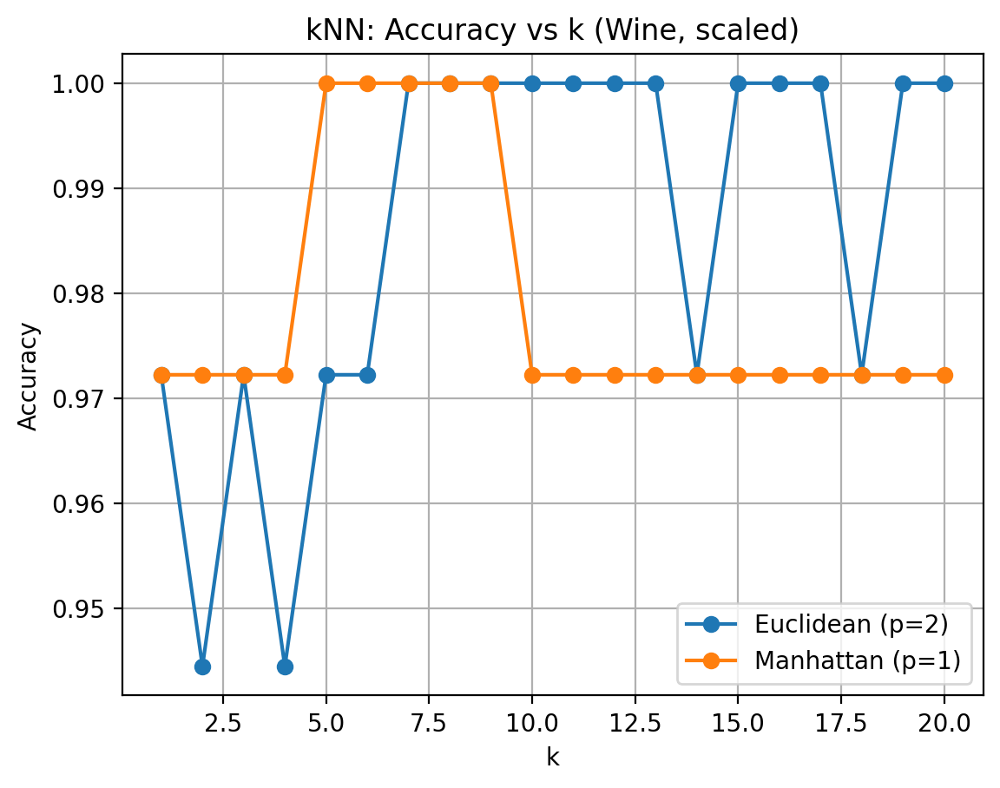
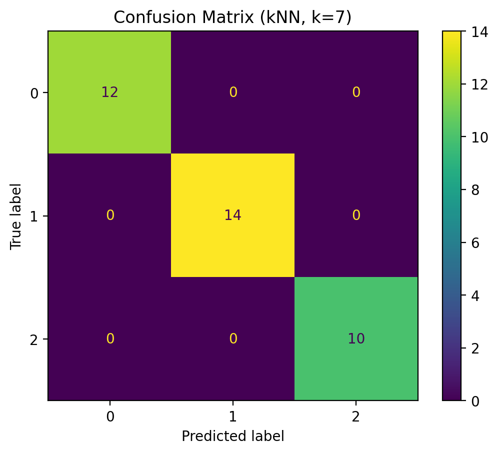

# Week 01 — kNN (Classification) on Wine Dataset

## Goal
Use kNN to classify Wine classes and choose k by evaluating performance on a test set.
Compare distance metrics (Euclidean vs Manhattan) and use scaling to ensure distances are comparable.

## Dataset
- Wine dataset (sklearn built-in), 178 samples, 13 numeric features, 3 classes
- Train/test split: 80/20 (stratified)

## Method
- Scaling: StandardScaler
- Model: KNeighborsClassifier
- k tested: 1..20
- Distance: Euclidean (p=2) and Manhattan (p=1)

## Choosing k

This graph shows how accuracy changes with k; I select the k that gives the best accuracy (using Euclidean as the main baseline).

## Results
- Final k: __
- Final accuracy: __

This graph shows the classification performance across the three classes.

## Discussion
- kNN is distance-based, so scaling is important.
- Larger k can smooth noise but may reduce sensitivity to local structure.
