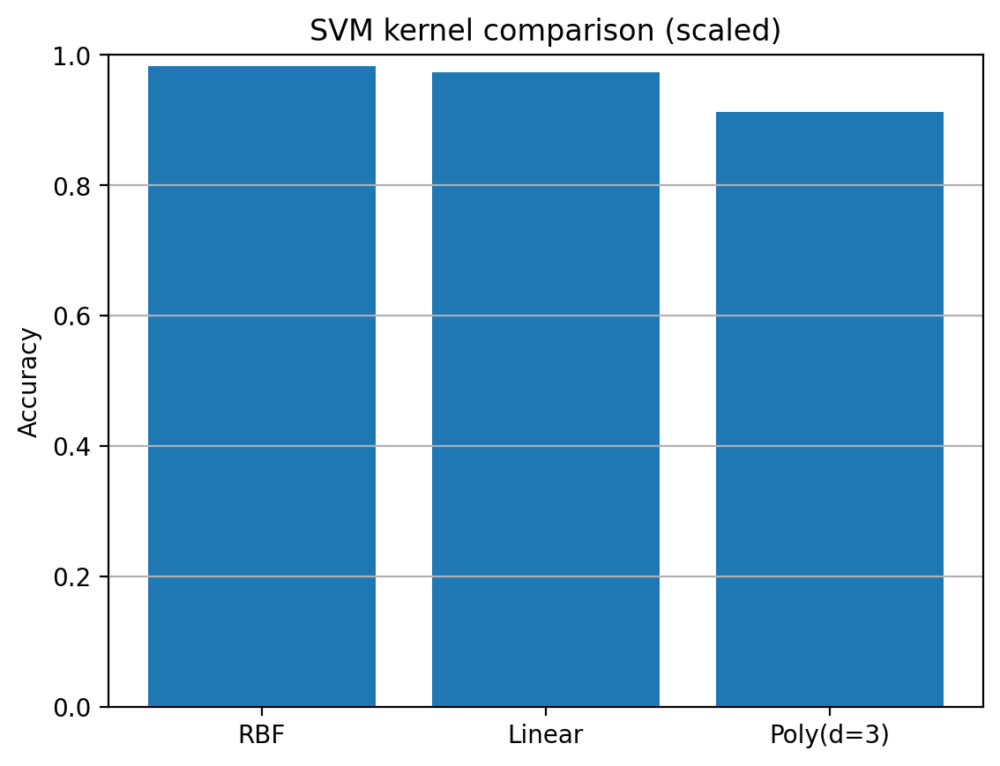
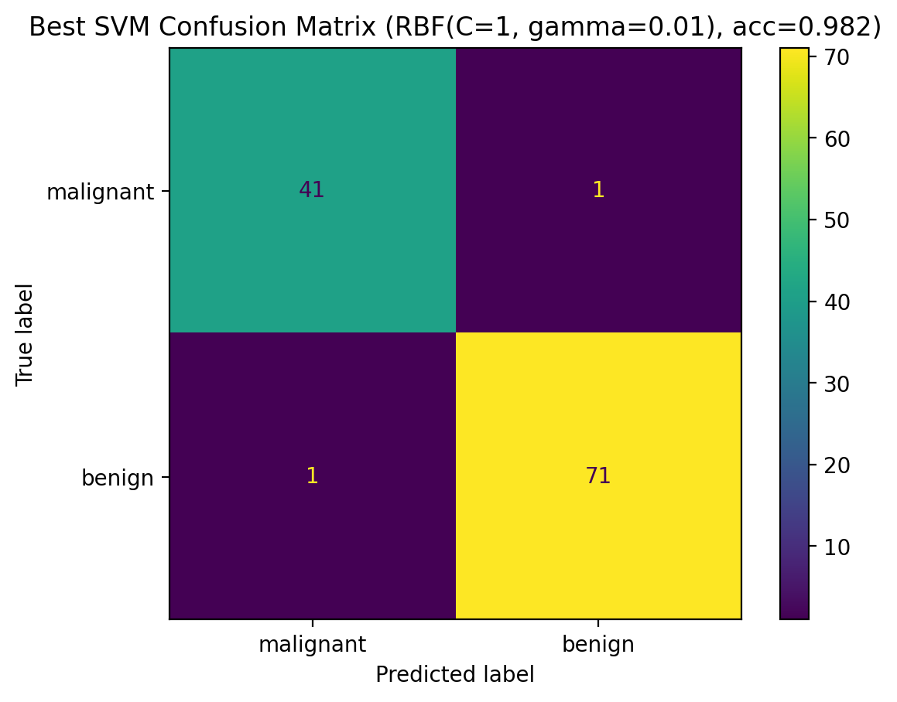
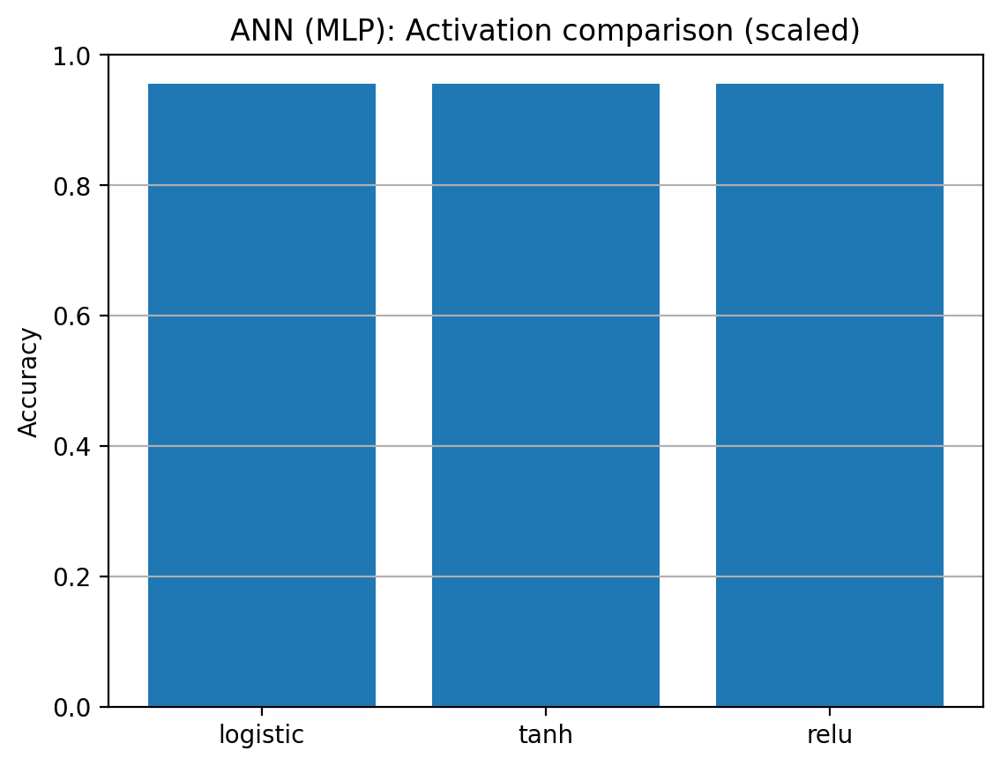
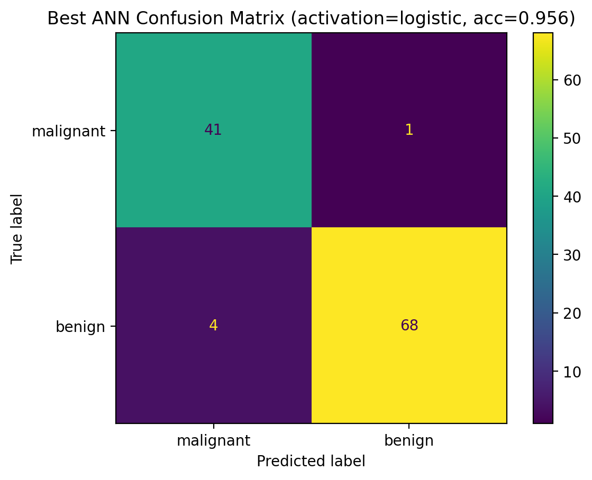

# Week 02 — SVM & ANN (Breast Cancer Dataset)

## Goal
This week I explored two supervised learning approaches: **Support Vector Machines (SVM)** and **Artificial Neural Networks (ANN)**.
I compared linear vs kernel SVM models and tuned key hyperparameters, then trained a feed-forward neural network and compared activation functions.

## Dataset
- Breast Cancer Wisconsin (sklearn built-in)
- Task: binary classification--malignant vs benign
- Train/test split: 80/20 (stratified), random_state=42
- Preprocessing: StandardScaler (feature magnitudes differ across columns, so scaling is required)

## SVM
### Kernel comparison

This graph shows that the **RBF kernel** achieved the best accuracy, followed by the **linear** kernel, while the polynomial kernel performed slightly worse.

### RBF tuning
I tuned **C ∈ {0.1, 1, 10}** and **gamma ∈ {0.01, 0.1, 1}** for the RBF SVM.
The best configuration was **RBF(C=1, gamma=0.01)** with test accuracy **≈ 0.982** (112/114 correct).
Tuning results were saved to: `../images/week02_svm_rbf_tuning_table.csv`.

This graph shows only two misclassifications on the test set: **1 malignant predicted as benign** and **1 benign predicted as malignant**.

## ANN (MLP)
### Activation comparison

This graph shows that **logistic, tanh and relu** achieved the same test accuracy (**≈ 0.956**) under the chosen network settings, suggesting activation choice did not significantly change performance in this run.

- Best activation (tie): **logistic** (all equal)
- Best accuracy: **≈ 0.956** (109/114 correct)

This graph shows 5 misclassifications on the test set: **1 malignant predicted as benign** and **4 benign predicted as malignant**.

## Discussion
- SVM performance depended on kernel choice and hyperparameter tuning (C, gamma). The tuned RBF SVM achieved the best performance.
- ANN performance was similar across activation functions for this configuration; scaling improved training stability.
- Both approaches benefit from feature scaling due to geometry/distance sensitivity (SVM) and training stability (ANN).

## Conclusion
On this dataset, the best SVM model achieved **≈ 0.982** accuracy, while the best ANN (MLP) achieved **≈ 0.956** accuracy.
This week demonstrated how model choice (kernel/activation) and tuning can affect classification performance.
